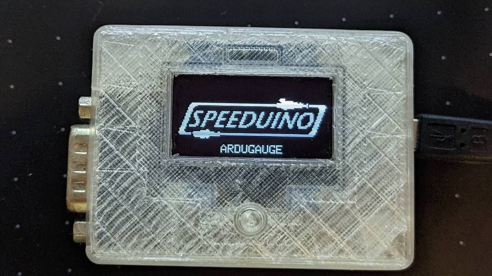

# speeduino-ardugauge

An OLED gauge for the Speeduino ECU. Uses UART (secondary serial) for communication. See [demo video](https://youtu.be/CHvzBlRpPmE).

_NOTE:_ The gauge shares the same Serial port for communcations with Speeduino ECU and USB connection for programming. Disconnect from the ECU if you wish to upload the Arduino sketch.

## Parts List

1. **Arduino Nano** - should work with most 328P arduino boards
2. **Monochrome OLED display** - 128x64 px, SSD1306 driver, I2C interface
3. **Push button** - with optional pull-up resistor.
4. **Connector** of your choice.

## Basic Pinout

| Arduino Pin | Connects To   |
| ----------- | ------------- |
| 5V          | Speeduino 5V  |
| D0-RX       | Speeduino TX3 |
| D1-TX       | Speeduino RX3 |
| GND         | Speeduino GND |
| 5V          | OLED 5V       |
| A5          | OLED SCL      |
| A4          | OLED SDA      |
| GND         | OLED GND      |
| D2          | Push Button   |
| GND         | Push Button   |

## Speeduino Settings

Enable `Secondary Serial` only. [Speeduino Manual](https://wiki.speeduino.com/en/Secondary_Serial_IO_interface)

## Customizable Pages

The pages displayed and the data within each page are customizable in the `ardugauge.ino` sketch file. The following is a quick guide on how to modify the pages.

1. The complete dataset is fetched at the start of each loop iteration and stored in a buffer. To get appropriate data, use:

   - `getByte(address);` - returns numeric value for single byte.
   - `getWord(address);` - returns numeric value for 2 bytes. Use `LB` address.
   - `getBit(address, bit);` - returns bit value for status bytes.

   See [Speeduino Manual](https://wiki.speeduino.com/en/Secondary_Serial_IO_interface) for the specific address.

   _NOTE:_ The temperature values are in °C and are offset by 40 to maximize single byte range. Subtract 40 from raw value then use appropriate conversion to °F if needed.

2. Create new `case` for new page. Inside, use one of the following commands:

   - `showNumeric(label,value,min,max,decimal);` - displays a single numeric value.
   - `showBar(label,value,min,max,decimal);` - displays a single numeric value with a bar graph.
   - `show2Bar(label1,value1,min1,max1,decimal1,...);` - displays 2 bar graphs.
   - `show4Numeric(label1,value1,min1,max1,decimal1,...);` - displays up to 4 numeric values.
   - `showFlags(label1,value1,...);` - displays up to 8 boolean flags.

   Do not forget to include a `break` command at the end of each `case` statement.

3. Update the `NUM_PAGES` constant in line 5.
